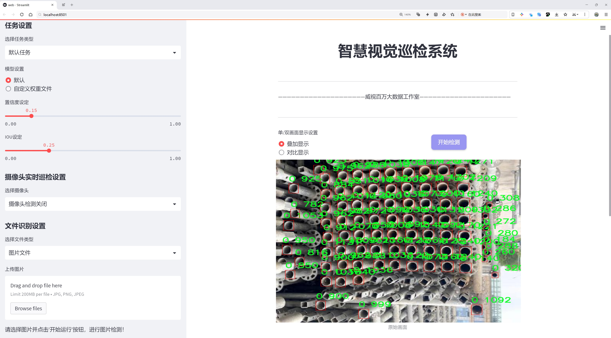
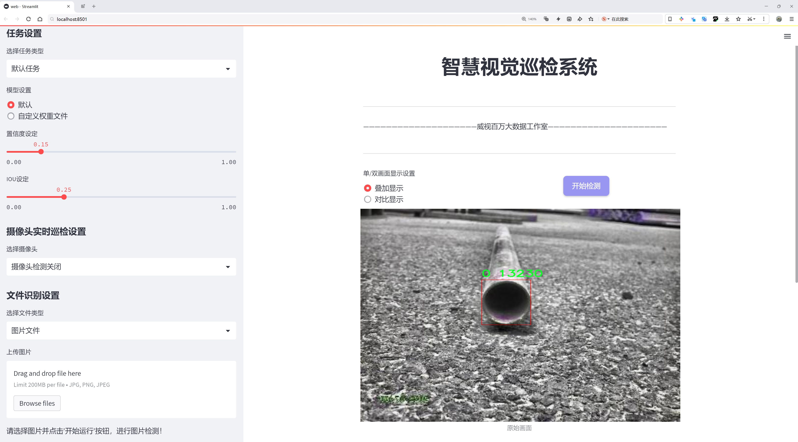

# 管道物体计数检测系统源码分享
 # [一条龙教学YOLOV8标注好的数据集一键训练_70+全套改进创新点发刊_Web前端展示]

### 1.研究背景与意义

项目参考[AAAI Association for the Advancement of Artificial Intelligence](https://gitee.com/qunmasj/projects)

项目来源[AACV Association for the Advancement of Computer Vision](https://kdocs.cn/l/cszuIiCKVNis)

研究背景与意义

随着工业化进程的加快，管道系统在各类工程中扮演着至关重要的角色，尤其是在石油、天然气和水处理等领域。管道的安全性与高效性直接影响到生产效率和环境保护，因此对管道内物体的实时监测与计数显得尤为重要。传统的人工监测方法不仅耗时耗力，而且容易出现人为错误，无法满足现代工业对实时性和准确性的高要求。因此，基于计算机视觉的自动化物体计数系统应运而生，成为提升管道监测效率的重要手段。

在众多计算机视觉技术中，YOLO（You Only Look Once）系列模型因其高效的实时检测能力而受到广泛关注。YOLOv8作为该系列的最新版本，进一步优化了模型的检测精度和速度，适用于多种复杂场景。然而，现有的YOLOv8模型在特定应用场景下仍存在一些不足，例如对小物体的检测精度不足、在复杂背景下的识别率低等。因此，改进YOLOv8以适应管道物体计数的需求，具有重要的研究价值和实际意义。

本研究将基于一个包含5100张图像的多类别数据集，针对管道内不同物体的计数进行深入探讨。该数据集包含11个类别，包括圆形、方形、管道等多种形状，涵盖了管道内可能出现的各类物体。这为模型的训练和测试提供了丰富的样本，有助于提高模型的泛化能力和适应性。通过对数据集的分析，我们可以更好地理解不同物体在管道环境中的特征，从而为模型的改进提供依据。

改进YOLOv8的管道物体计数系统，不仅能够提升管道监测的自动化水平，还能够为相关行业提供更为精准的数据支持，帮助企业优化生产流程，降低运营成本。此外，该系统的成功应用还将为其他领域的物体检测提供借鉴，推动计算机视觉技术在工业自动化中的广泛应用。

综上所述，基于改进YOLOv8的管道物体计数系统的研究，不仅具有重要的理论意义，还具备广泛的应用前景。通过对现有技术的改进与创新，我们期望能够为管道监测提供更为高效、准确的解决方案，为工业发展贡献一份力量。

### 2.图片演示






##### 注意：由于此博客编辑较早，上面“2.图片演示”和“3.视频演示”展示的系统图片或者视频可能为老版本，新版本在老版本的基础上升级如下：（实际效果以升级的新版本为准）

  （1）适配了YOLOV8的“目标检测”模型和“实例分割”模型，通过加载相应的权重（.pt）文件即可自适应加载模型。

  （2）支持“图片识别”、“视频识别”、“摄像头实时识别”三种识别模式。

  （3）支持“图片识别”、“视频识别”、“摄像头实时识别”三种识别结果保存导出，解决手动导出（容易卡顿出现爆内存）存在的问题，识别完自动保存结果并导出到tempDir中。

  （4）支持Web前端系统中的标题、背景图等自定义修改，后面提供修改教程。

  另外本项目提供训练的数据集和训练教程,暂不提供权重文件（best.pt）,需要您按照教程进行训练后实现图片演示和Web前端界面演示的效果。

### 3.视频演示

[3.1 视频演示](https://www.bilibili.com/video/BV1AQtUe6EJ7/)

### 4.数据集信息展示

##### 4.1 本项目数据集详细数据（类别数＆类别名）

nc: 1
names: ['0']


##### 4.2 本项目数据集信息介绍

数据集信息展示

在本研究中，我们采用了名为“object counter”的数据集，以改进YOLOv8的管道物体计数系统。该数据集专门设计用于物体计数任务，尤其是在复杂环境中对特定物体进行精确计数的应用场景。数据集的类别数量为1，类别列表中仅包含一个类别，标记为“0”。这一设计简化了模型的训练过程，使得研究者能够专注于特定物体的识别与计数，而不必处理多类别之间的干扰。

“object counter”数据集的构建旨在提供高质量的标注数据，以便于训练深度学习模型进行物体检测和计数。该数据集包含了多种场景下的图像，涵盖了不同的光照条件、背景复杂度以及物体的大小和形状变化。这种多样性确保了模型在实际应用中的鲁棒性，能够适应不同的环境变化和挑战。通过对数据集的精心设计，我们希望能够提高YOLOv8在管道物体计数任务中的准确性和效率。

在数据集的标注过程中，所有图像均经过专业人员的仔细审查和标注，确保每个物体的边界框准确无误。尽管类别数量仅为1，但每个图像中物体的数量和分布可能存在显著差异，这为模型的学习提供了丰富的样本。通过这种方式，模型不仅能够学习到如何识别物体，还能够掌握在不同场景中如何进行有效的计数。

为了进一步提升模型的性能，我们在数据集的使用过程中，结合了数据增强技术。这些技术包括随机裁剪、旋转、缩放以及颜色变换等，旨在增加训练样本的多样性，从而提高模型的泛化能力。通过这种方式，我们希望模型能够在面对未见过的图像时，依然保持良好的识别和计数能力。

在实验过程中，我们将“object counter”数据集与YOLOv8模型进行结合，进行了一系列的训练和验证。通过对模型在不同测试集上的表现进行评估，我们能够获得关于模型在实际应用中性能的深刻洞察。这些评估不仅包括模型的准确率，还涵盖了其在不同环境下的响应速度和处理能力。

总之，“object counter”数据集为改进YOLOv8的管道物体计数系统提供了坚实的基础。通过精心设计的单类别数据集，我们能够有效地训练出一个高效、准确的物体计数模型，为未来在智能监控、交通管理以及工业自动化等领域的应用奠定基础。随着研究的深入，我们期待能够进一步优化模型的性能，使其在实际应用中发挥更大的作用。


### 5.全套项目环境部署视频教程（零基础手把手教学）

[5.1 环境部署教程链接（零基础手把手教学）](https://www.ixigua.com/7404473917358506534?logTag=c807d0cbc21c0ef59de5)


[5.2 安装Python虚拟环境创建和依赖库安装视频教程链接（零基础手把手教学）](https://www.ixigua.com/7404474678003106304?logTag=1f1041108cd1f708b01a)

### 6.手把手YOLOV8训练视频教程（零基础小白有手就能学会）

[6.1 手把手YOLOV8训练视频教程（零基础小白有手就能学会）](https://www.ixigua.com/7404477157818401292?logTag=d31a2dfd1983c9668658)

### 7.70+种全套YOLOV8创新点代码加载调参视频教程（一键加载写好的改进模型的配置文件）

[7.1 70+种全套YOLOV8创新点代码加载调参视频教程（一键加载写好的改进模型的配置文件）](https://www.ixigua.com/7404478314661806627?logTag=29066f8288e3f4eea3a4)

### 8.70+种全套YOLOV8创新点原理讲解（非科班也可以轻松写刊发刊，V10版本正在科研待更新）

由于篇幅限制，每个创新点的具体原理讲解就不一一展开，具体见下列网址中的创新点对应子项目的技术原理博客网址【Blog】：


[8.1 70+种全套YOLOV8创新点原理讲解链接](https://gitee.com/qunmasj/good)

### 9.系统功能展示（检测对象为举例，实际内容以本项目数据集为准）

图9.1.系统支持检测结果表格显示

  图9.2.系统支持置信度和IOU阈值手动调节

  图9.3.系统支持自定义加载权重文件best.pt(需要你通过步骤5中训练获得)

  图9.4.系统支持摄像头实时识别

  图9.5.系统支持图片识别

  图9.6.系统支持视频识别

  图9.7.系统支持识别结果文件自动保存

  图9.8.系统支持Excel导出检测结果数据


### 10.原始YOLOV8算法原理

原始YOLOv8算法原理

YOLOv8模型是由Ultralytics团队在YOLOv5的基础上发展而来的，经过近两年半的实践验证，融入了众多改进和创新。该模型于2023年1月正式提出，标志着YOLO系列目标检测算法的又一次重大进步。YOLOv8的设计理念依然延续了YOLO系列一贯的高效性和实时性，但在结构和性能上进行了深度优化，尤其是在特征提取、特征融合和检测头的设计上。

在YOLOv8的输入阶段，模型对数据增强的策略进行了重新审视。以往的Mosaic数据增强虽然能够提高模型的鲁棒性和泛化能力，但也可能在一定程度上破坏数据的真实分布，导致模型学习到一些不良信息。因此，YOLOv8在训练的最后10个epoch中停止使用Mosaic数据增强，以确保模型在接近真实数据分布的条件下进行学习。这一改进旨在提高模型的准确性和稳定性，使其在实际应用中表现得更加可靠。

在网络结构方面，YOLOv8的主干网络保持了相对稳定的架构，但将C3模块替换为C2f模块。C2f模块的设计灵感来源于YOLOv7中的ELAN结构，增加了更多的跳层连接，从而增强了梯度流的丰富性。这种设计不仅提升了模型的学习能力，还在一定程度上实现了模型的轻量化，确保了在复杂任务下的高效运行。同时，YOLOv8保留了SPPF（Spatial Pyramid Pooling Fast）模块，这一模块在保持效果的同时显著减少了执行时间，使得整体模型的推理速度得到了提升。

在颈部网络的设计中，YOLOv8同样将所有的C3模块替换为C2f模块，并且删除了两处上采样之前的卷积连接层。这一改动不仅简化了网络结构，还提高了特征融合的效率，使得模型在处理不同尺度的特征时更加灵活。特征融合层采用了BiFPN（Bidirectional Feature Pyramid Network）结构，旨在通过高效的双向跨尺度连接和加权特征融合，进一步提升模型对不同尺度特征信息的提取速度。这种设计使得YOLOv8在面对复杂场景时，能够更好地捕捉到目标的多样性和变化性。

在检测头的设计上，YOLOv8借鉴了YOLOX的解耦头思想，采用了两条并行的分支来分别提取类别和位置特征。这种结构的优势在于，分类任务更关注特征图中提取到的特征与已有类别的相似性，而定位任务则侧重于边界框与真实框之间的关系。通过将这两种任务分开处理，YOLOv8能够在收敛速度和预测精度上实现显著提升。此外，YOLOv8采用了无锚框结构，直接预测目标的中心位置，并引入了任务对齐学习（Task Alignment Learning，TAL）机制来区分正负样本。这一机制通过引入分类分数和IOU的高次幂乘积作为衡量任务对齐程度的指标，确保了模型在分类和定位任务中的高效协同。

在性能评估方面，YOLOv8在COCO数据集上的表现令人瞩目。通过对比不同尺寸模型的mAP（mean Average Precision）值，YOLOv8在参数量未显著增加的情况下，展现出了优于其他YOLO系列模型的精度。同时，在推理速度上，YOLOv8也实现了更快的响应时间，确保了在实时应用场景中的有效性。这些改进使得YOLOv8在目标检测任务中具备了更强的竞争力，尤其是在需要兼顾实时性和准确性的应用场景中，展现出了巨大的潜力。

综上所述，YOLOv8模型通过对数据增强策略的调整、网络结构的优化以及检测头的创新，极大地提升了目标检测的性能和效率。作为YOLO系列的最新成员，YOLOv8不仅在理论上推动了目标检测技术的发展，更在实际应用中展现出了广泛的适用性和研究价值。随着对YOLOv8的深入研究和应用，未来有望在更为复杂的场景中实现更高效的目标检测，推动智能视觉技术的进一步发展。


### 11.项目核心源码讲解（再也不用担心看不懂代码逻辑）

#### 11.1 70+种YOLOv8算法改进源码大全和调试加载训练教程（非必要）\ultralytics\models\sam\modules\decoders.py

以下是经过精简和注释的核心代码部分，保留了 `MaskDecoder` 和 `MLP` 类的关键功能，并对每个部分进行了详细的中文注释。

```python
import torch
from torch import nn
from torch.nn import functional as F
from typing import List, Tuple, Type

class MaskDecoder(nn.Module):
    """
    MaskDecoder类用于生成掩码及其质量评分，使用变换器架构根据图像和提示嵌入预测掩码。
    """

    def __init__(
        self,
        *,
        transformer_dim: int,
        transformer: nn.Module,
        num_multimask_outputs: int = 3,
        activation: Type[nn.Module] = nn.GELU,
        iou_head_depth: int = 3,
        iou_head_hidden_dim: int = 256,
    ) -> None:
        """
        初始化MaskDecoder。

        Args:
            transformer_dim (int): 变换器模块的通道维度
            transformer (nn.Module): 用于预测掩码的变换器
            num_multimask_outputs (int): 预测的掩码数量
            activation (nn.Module): 用于上采样掩码的激活函数
            iou_head_depth (int): 用于预测掩码质量的MLP深度
            iou_head_hidden_dim (int): 用于预测掩码质量的MLP隐藏维度
        """
        super().__init__()
        self.transformer_dim = transformer_dim
        self.transformer = transformer
        self.num_multimask_outputs = num_multimask_outputs

        # IoU令牌的嵌入
        self.iou_token = nn.Embedding(1, transformer_dim)
        # 掩码令牌的数量
        self.num_mask_tokens = num_multimask_outputs + 1
        self.mask_tokens = nn.Embedding(self.num_mask_tokens, transformer_dim)

        # 输出上采样网络
        self.output_upscaling = nn.Sequential(
            nn.ConvTranspose2d(transformer_dim, transformer_dim // 4, kernel_size=2, stride=2),
            nn.LayerNorm(transformer_dim // 4),
            activation(),
            nn.ConvTranspose2d(transformer_dim // 4, transformer_dim // 8, kernel_size=2, stride=2),
            activation(),
        )
        
        # 用于生成掩码的超网络MLP
        self.output_hypernetworks_mlps = nn.ModuleList([
            MLP(transformer_dim, transformer_dim, transformer_dim // 8, 3) for _ in range(self.num_mask_tokens)
        ])

        # 预测掩码质量的MLP
        self.iou_prediction_head = MLP(transformer_dim, iou_head_hidden_dim, self.num_mask_tokens, iou_head_depth)

    def forward(
        self,
        image_embeddings: torch.Tensor,
        image_pe: torch.Tensor,
        sparse_prompt_embeddings: torch.Tensor,
        dense_prompt_embeddings: torch.Tensor,
        multimask_output: bool,
    ) -> Tuple[torch.Tensor, torch.Tensor]:
        """
        根据图像和提示嵌入预测掩码。

        Args:
            image_embeddings (torch.Tensor): 图像编码器的嵌入
            image_pe (torch.Tensor): 图像嵌入的位置信息
            sparse_prompt_embeddings (torch.Tensor): 稀疏提示的嵌入
            dense_prompt_embeddings (torch.Tensor): 密集提示的嵌入
            multimask_output (bool): 是否返回多个掩码

        Returns:
            torch.Tensor: 预测的掩码
            torch.Tensor: 掩码质量的预测
        """
        masks, iou_pred = self.predict_masks(
            image_embeddings=image_embeddings,
            image_pe=image_pe,
            sparse_prompt_embeddings=sparse_prompt_embeddings,
            dense_prompt_embeddings=dense_prompt_embeddings,
        )

        # 根据输出选择正确的掩码
        mask_slice = slice(1, None) if multimask_output else slice(0, 1)
        masks = masks[:, mask_slice, :, :]
        iou_pred = iou_pred[:, mask_slice]

        return masks, iou_pred

    def predict_masks(
        self,
        image_embeddings: torch.Tensor,
        image_pe: torch.Tensor,
        sparse_prompt_embeddings: torch.Tensor,
        dense_prompt_embeddings: torch.Tensor,
    ) -> Tuple[torch.Tensor, torch.Tensor]:
        """
        预测掩码。

        Args:
            image_embeddings (torch.Tensor): 图像编码器的嵌入
            image_pe (torch.Tensor): 图像嵌入的位置信息
            sparse_prompt_embeddings (torch.Tensor): 稀疏提示的嵌入
            dense_prompt_embeddings (torch.Tensor): 密集提示的嵌入

        Returns:
            Tuple[torch.Tensor, torch.Tensor]: 预测的掩码和IoU预测
        """
        # 连接输出令牌
        output_tokens = torch.cat([self.iou_token.weight, self.mask_tokens.weight], dim=0)
        output_tokens = output_tokens.unsqueeze(0).expand(sparse_prompt_embeddings.size(0), -1, -1)
        tokens = torch.cat((output_tokens, sparse_prompt_embeddings), dim=1)

        # 扩展每个图像的数据以适应每个掩码
        src = torch.repeat_interleave(image_embeddings, tokens.shape[0], dim=0)
        src = src + dense_prompt_embeddings
        pos_src = torch.repeat_interleave(image_pe, tokens.shape[0], dim=0)

        # 运行变换器
        hs, src = self.transformer(src, pos_src, tokens)
        iou_token_out = hs[:, 0, :]
        mask_tokens_out = hs[:, 1:(1 + self.num_mask_tokens), :]

        # 上采样掩码嵌入并预测掩码
        src = src.transpose(1, 2).view(src.shape[0], self.transformer_dim, -1)
        upscaled_embedding = self.output_upscaling(src)
        hyper_in_list: List[torch.Tensor] = [
            self.output_hypernetworks_mlps[i](mask_tokens_out[:, i, :]) for i in range(self.num_mask_tokens)
        ]
        hyper_in = torch.stack(hyper_in_list, dim=1)
        masks = (hyper_in @ upscaled_embedding.view(src.shape[0], -1)).view(src.shape[0], -1, int(src.shape[2]**0.5), int(src.shape[2]**0.5))

        # 生成掩码质量预测
        iou_pred = self.iou_prediction_head(iou_token_out)

        return masks, iou_pred


class MLP(nn.Module):
    """
    MLP（多层感知器）模型，用于掩码质量预测。
    """

    def __init__(
        self,
        input_dim: int,
        hidden_dim: int,
        output_dim: int,
        num_layers: int,
        sigmoid_output: bool = False,
    ) -> None:
        """
        初始化MLP。

        Args:
            input_dim (int): 输入特征的维度
            hidden_dim (int): 隐藏层的维度
            output_dim (int): 输出层的维度
            num_layers (int): 隐藏层的数量
            sigmoid_output (bool): 是否对输出层应用sigmoid激活
        """
        super().__init__()
        self.num_layers = num_layers
        h = [hidden_dim] * (num_layers - 1)
        self.layers = nn.ModuleList(nn.Linear(n, k) for n, k in zip([input_dim] + h, h + [output_dim]))
        self.sigmoid_output = sigmoid_output

    def forward(self, x):
        """执行前向传播并应用激活函数。"""
        for i, layer in enumerate(self.layers):
            x = F.relu(layer(x)) if i < self.num_layers - 1 else layer(x)
        if self.sigmoid_output:
            x = torch.sigmoid(x)
        return x
```

### 代码说明：
1. **MaskDecoder 类**：用于生成掩码和预测质量分数。其构造函数初始化了变换器、IoU令牌、掩码令牌、上采样网络和预测头。
2. **forward 方法**：接收图像和提示嵌入，调用 `predict_masks` 方法生成掩码和质量预测，并根据 `multimask_output` 参数选择输出。
3. **predict_masks 方法**：负责实际的掩码预测，包括连接令牌、运行变换器、上采样和生成掩码质量预测。
4. **MLP 类**：一个简单的多层感知器，用于生成掩码质量预测。支持多层和可选的sigmoid输出。

这样，代码的核心功能得以保留，并且通过注释提供了清晰的理解。

这个文件定义了一个名为 `MaskDecoder` 的类，它是一个用于生成掩码及其相关质量评分的解码器模块，采用了变换器（Transformer）架构。该模块的主要功能是根据图像和提示嵌入（prompt embeddings）来预测掩码。

在 `MaskDecoder` 类的构造函数中，首先定义了一些属性，包括变换器的通道维度、变换器模块本身、要预测的掩码数量、IoU（Intersection over Union）标记的嵌入、掩码标记的嵌入、输出上采样的神经网络序列、用于生成掩码的超网络 MLP 列表，以及用于预测掩码质量的 MLP。

在 `forward` 方法中，输入包括图像嵌入、图像位置编码、稀疏提示嵌入和密集提示嵌入。该方法首先调用 `predict_masks` 方法来生成掩码和 IoU 预测。然后，根据是否需要多掩码输出来选择相应的掩码和 IoU 预测，最后返回这些结果。

`predict_masks` 方法负责实际的掩码预测。它首先将 IoU 标记和掩码标记的权重连接在一起，并与稀疏提示嵌入拼接。接着，它扩展图像嵌入数据，以便在批处理方向上为每个掩码提供数据。然后，调用变换器进行处理，得到 IoU 标记和掩码标记的输出。接下来，掩码嵌入被上采样，并通过超网络 MLP 生成最终的掩码。最后，生成 IoU 预测。

此外，文件中还定义了一个 `MLP` 类，表示多层感知器（Multi-Layer Perceptron）。该类的构造函数接受输入维度、隐藏层维度、输出维度和层数等参数，并构建相应的线性层。`forward` 方法则实现了前向传播过程，应用激活函数并返回输出。

总体来说，这个文件实现了一个复杂的掩码解码器，利用变换器架构来处理图像和提示信息，从而生成高质量的掩码和相关的质量评分。

#### 11.2 ui.py

以下是经过简化并添加详细中文注释的核心代码部分：

```python
import sys
import subprocess

def run_script(script_path):
    """
    使用当前 Python 环境运行指定的脚本。

    Args:
        script_path (str): 要运行的脚本路径

    Returns:
        None
    """
    # 获取当前 Python 解释器的路径
    python_path = sys.executable

    # 构建运行命令，使用 streamlit 运行指定的脚本
    command = f'"{python_path}" -m streamlit run "{script_path}"'

    # 执行命令并等待其完成
    result = subprocess.run(command, shell=True)
    
    # 检查命令执行结果，如果返回码不为0，表示执行出错
    if result.returncode != 0:
        print("脚本运行出错。")

# 实例化并运行应用
if __name__ == "__main__":
    # 指定要运行的脚本路径
    script_path = "web.py"  # 这里可以直接指定脚本名

    # 调用函数运行脚本
    run_script(script_path)
```

### 代码说明：
1. **导入模块**：
   - `sys`：用于获取当前 Python 解释器的路径。
   - `subprocess`：用于执行外部命令。

2. **定义 `run_script` 函数**：
   - 接受一个参数 `script_path`，表示要运行的脚本的路径。
   - 使用 `sys.executable` 获取当前 Python 解释器的路径。
   - 构建一个命令字符串，用于运行 `streamlit` 应用。
   - 使用 `subprocess.run` 执行构建的命令，并等待其完成。
   - 检查命令的返回码，如果不为0，则输出错误信息。

3. **主程序块**：
   - 在 `__main__` 块中，指定要运行的脚本路径（这里直接使用 `"web.py"`）。
   - 调用 `run_script` 函数来执行指定的脚本。

这个程序文件名为 `ui.py`，主要功能是使用当前的 Python 环境来运行一个指定的脚本，具体是通过 Streamlit 来启动一个 Web 应用。

首先，程序导入了必要的模块，包括 `sys`、`os` 和 `subprocess`。其中，`sys` 模块用于访问与 Python 解释器相关的变量和函数，`os` 模块提供了与操作系统交互的功能，而 `subprocess` 模块则用于执行外部命令。

接下来，程序从 `QtFusion.path` 模块中导入了 `abs_path` 函数，这个函数的作用是获取文件的绝对路径。

在 `run_script` 函数中，程序接受一个参数 `script_path`，这个参数是要运行的脚本的路径。函数首先获取当前 Python 解释器的路径，并将其存储在 `python_path` 变量中。然后，程序构建了一个命令字符串，使用 `streamlit run` 命令来运行指定的脚本。这里使用了 Python 的 f-string 格式化字符串功能，将 `python_path` 和 `script_path` 嵌入到命令中。

接下来，程序使用 `subprocess.run` 方法来执行构建好的命令。`shell=True` 参数允许在 shell 中执行命令。执行完命令后，程序检查返回的结果，如果返回码不为 0，表示脚本运行出错，程序会打印出错误信息。

在文件的最后部分，程序通过 `if __name__ == "__main__":` 判断是否是直接运行该脚本。如果是，程序会调用 `abs_path` 函数来获取 `web.py` 脚本的绝对路径，并将其传递给 `run_script` 函数以执行。

总体来说，这个程序的核心功能是启动一个 Streamlit Web 应用，具体的应用脚本是 `web.py`，并且能够处理运行过程中的错误。

#### 11.3 code\ultralytics\models\nas\predict.py

以下是经过简化和注释的核心代码部分：

```python
import torch
from ultralytics.engine.predictor import BasePredictor
from ultralytics.engine.results import Results
from ultralytics.utils import ops

class NASPredictor(BasePredictor):
    """
    Ultralytics YOLO NAS 预测器，用于目标检测。

    该类扩展了 Ultralytics 引擎中的 `BasePredictor`，负责对 YOLO NAS 模型生成的原始预测结果进行后处理。
    它应用非极大值抑制（NMS）等操作，并将边界框缩放以适应原始图像的尺寸。
    """

    def postprocess(self, preds_in, img, orig_imgs):
        """对预测结果进行后处理，并返回结果对象的列表。"""

        # 将预测结果中的边界框转换为 xywh 格式（左上角和宽高）
        boxes = ops.xyxy2xywh(preds_in[0][0])
        
        # 将边界框和类分数拼接在一起，并调整维度
        preds = torch.cat((boxes, preds_in[0][1]), -1).permute(0, 2, 1)

        # 应用非极大值抑制，过滤掉冗余的边界框
        preds = ops.non_max_suppression(
            preds,
            self.args.conf,         # 置信度阈值
            self.args.iou,          # IOU 阈值
            agnostic=self.args.agnostic_nms,  # 是否进行类别无关的 NMS
            max_det=self.args.max_det,          # 最大检测数量
            classes=self.args.classes,           # 需要检测的类别
        )

        # 如果输入图像不是列表，则将其转换为 numpy 数组
        if not isinstance(orig_imgs, list):
            orig_imgs = ops.convert_torch2numpy_batch(orig_imgs)

        results = []
        # 遍历每个预测结果
        for i, pred in enumerate(preds):
            orig_img = orig_imgs[i]  # 获取原始图像
            # 将边界框缩放到原始图像的尺寸
            pred[:, :4] = ops.scale_boxes(img.shape[2:], pred[:, :4], orig_img.shape)
            img_path = self.batch[0][i]  # 获取图像路径
            # 创建结果对象并添加到结果列表中
            results.append(Results(orig_img, path=img_path, names=self.model.names, boxes=pred))
        
        return results  # 返回后处理的结果列表
```

### 代码注释说明：
1. **类定义**：`NASPredictor` 继承自 `BasePredictor`，用于 YOLO NAS 模型的目标检测。
2. **postprocess 方法**：这是后处理的核心方法，接收原始预测结果、输入图像和原始图像，返回处理后的结果。
3. **边界框转换**：使用 `ops.xyxy2xywh` 将预测的边界框格式从 (x1, y1, x2, y2) 转换为 (x_center, y_center, width, height)。
4. **拼接和维度调整**：将边界框和类分数拼接，并调整维度以便后续处理。
5. **非极大值抑制**：使用 `ops.non_max_suppression` 来过滤掉重叠的边界框，以保留最有可能的检测结果。
6. **图像格式转换**：如果输入的原始图像不是列表格式，则将其转换为 numpy 数组。
7. **结果构建**：遍历每个预测结果，缩放边界框并创建 `Results` 对象，最后返回所有结果。

该程序文件是Ultralytics YOLO NAS模型的预测模块，主要用于对YOLO NAS模型生成的原始预测结果进行后处理。它继承自Ultralytics引擎中的`BasePredictor`类，负责将模型的输出转换为可用的检测结果。

在类的文档字符串中，说明了该类的用途和基本功能。它提到，`NASPredictor`类的主要任务是对YOLO NAS模型生成的原始预测进行后处理，包括非极大值抑制（NMS）和将边界框缩放到原始图像的尺寸。

该类的主要属性是`args`，它是一个命名空间对象，包含了后处理所需的各种配置参数。

在使用示例中，首先从`ultralytics`库中导入`NAS`类，然后创建一个YOLO NAS模型实例，接着获取该模型的预测器。假设已经有了原始预测结果`raw_preds`、输入图像`img`和原始图像`orig_imgs`，可以调用`postprocess`方法来处理这些预测结果。

`postprocess`方法是该类的核心功能。它接收三个参数：`preds_in`（原始预测结果）、`img`（输入图像）和`orig_imgs`（原始图像）。该方法首先将预测框的坐标从xyxy格式转换为xywh格式，并将预测框与对应的类分数合并。接着，调用`non_max_suppression`函数对预测结果进行非极大值抑制，以去除重叠的框。

在处理完预测框后，方法检查输入的原始图像是否为列表格式，如果不是，则将其转换为NumPy数组格式。接下来，方法遍历每个预测结果，将边界框缩放到原始图像的尺寸，并将结果存储在`Results`对象中，最后返回这些结果。

总的来说，该文件实现了YOLO NAS模型的预测后处理功能，使得用户能够获得经过处理的检测结果，包括边界框和对应的类信息。

#### 11.4 train.py

以下是经过简化和注释的核心代码部分：

```python
import random
import numpy as np
import torch.nn as nn
from ultralytics.data import build_dataloader, build_yolo_dataset
from ultralytics.engine.trainer import BaseTrainer
from ultralytics.models import yolo
from ultralytics.nn.tasks import DetectionModel
from ultralytics.utils import LOGGER, RANK
from ultralytics.utils.torch_utils import de_parallel, torch_distributed_zero_first

class DetectionTrainer(BaseTrainer):
    """
    DetectionTrainer类用于基于YOLO模型进行目标检测的训练。
    """

    def build_dataset(self, img_path, mode="train", batch=None):
        """
        构建YOLO数据集。

        参数:
            img_path (str): 包含图像的文件夹路径。
            mode (str): 模式，可以是'train'或'val'，用于自定义不同的增强方法。
            batch (int, optional): 批次大小，适用于'rect'模式。默认为None。
        """
        gs = max(int(de_parallel(self.model).stride.max() if self.model else 0), 32)  # 获取模型的最大步幅
        return build_yolo_dataset(self.args, img_path, batch, self.data, mode=mode, rect=mode == "val", stride=gs)

    def get_dataloader(self, dataset_path, batch_size=16, rank=0, mode="train"):
        """构建并返回数据加载器。"""
        assert mode in ["train", "val"]  # 确保模式有效
        with torch_distributed_zero_first(rank):  # 在分布式环境中只初始化一次数据集
            dataset = self.build_dataset(dataset_path, mode, batch_size)
        shuffle = mode == "train"  # 训练模式下打乱数据
        workers = self.args.workers if mode == "train" else self.args.workers * 2  # 根据模式设置工作线程数
        return build_dataloader(dataset, batch_size, workers, shuffle, rank)  # 返回数据加载器

    def preprocess_batch(self, batch):
        """对图像批次进行预处理，包括缩放和转换为浮点数。"""
        batch["img"] = batch["img"].to(self.device, non_blocking=True).float() / 255  # 将图像转换为浮点数并归一化
        if self.args.multi_scale:  # 如果启用多尺度训练
            imgs = batch["img"]
            sz = (
                random.randrange(self.args.imgsz * 0.5, self.args.imgsz * 1.5 + self.stride)
                // self.stride
                * self.stride
            )  # 随机选择新的图像大小
            sf = sz / max(imgs.shape[2:])  # 计算缩放因子
            if sf != 1:
                ns = [
                    math.ceil(x * sf / self.stride) * self.stride for x in imgs.shape[2:]
                ]  # 计算新的形状
                imgs = nn.functional.interpolate(imgs, size=ns, mode="bilinear", align_corners=False)  # 调整图像大小
            batch["img"] = imgs
        return batch

    def get_model(self, cfg=None, weights=None, verbose=True):
        """返回YOLO目标检测模型。"""
        model = DetectionModel(cfg, nc=self.data["nc"], verbose=verbose and RANK == -1)  # 创建检测模型
        if weights:
            model.load(weights)  # 加载权重
        return model

    def plot_training_samples(self, batch, ni):
        """绘制训练样本及其注释。"""
        plot_images(
            images=batch["img"],
            batch_idx=batch["batch_idx"],
            cls=batch["cls"].squeeze(-1),
            bboxes=batch["bboxes"],
            paths=batch["im_file"],
            fname=self.save_dir / f"train_batch{ni}.jpg",
            on_plot=self.on_plot,
        )

    def plot_metrics(self):
        """从CSV文件中绘制指标。"""
        plot_results(file=self.csv, on_plot=self.on_plot)  # 保存结果图像
```

### 代码说明：
1. **DetectionTrainer类**：继承自`BaseTrainer`，用于处理YOLO模型的训练。
2. **build_dataset方法**：根据给定的图像路径和模式构建YOLO数据集，支持训练和验证模式。
3. **get_dataloader方法**：构建数据加载器，支持多线程和数据打乱。
4. **preprocess_batch方法**：对输入的图像批次进行预处理，包括归一化和可选的多尺度调整。
5. **get_model方法**：返回一个YOLO目标检测模型，并可选择加载预训练权重。
6. **plot_training_samples方法**：绘制训练样本及其对应的标签。
7. **plot_metrics方法**：从CSV文件中绘制训练过程中的指标。

这个程序文件 `train.py` 是一个用于训练 YOLO（You Only Look Once）目标检测模型的实现，基于 Ultralytics 的框架。程序首先导入了必要的库和模块，包括数学运算、随机数生成、深度学习框架 PyTorch 相关的模块，以及 Ultralytics 提供的数据处理和模型训练的工具。

在文件中，定义了一个名为 `DetectionTrainer` 的类，该类继承自 `BaseTrainer`，专门用于基于检测模型的训练。类的文档字符串中给出了一个使用示例，展示了如何创建 `DetectionTrainer` 的实例并调用 `train` 方法进行训练。

`DetectionTrainer` 类中包含多个方法：

- `build_dataset` 方法用于构建 YOLO 数据集，接受图像路径、模式（训练或验证）和批次大小作为参数。该方法会根据模型的步幅计算最大步幅，并调用 `build_yolo_dataset` 函数来创建数据集。

- `get_dataloader` 方法用于构建和返回数据加载器。它会检查模式是否为训练或验证，并在分布式训练时确保数据集只初始化一次。根据模式设置是否打乱数据，并返回构建好的数据加载器。

- `preprocess_batch` 方法用于对图像批次进行预处理，包括将图像缩放并转换为浮点数。它还支持多尺度训练，通过随机选择图像大小来增强模型的鲁棒性。

- `set_model_attributes` 方法用于设置模型的属性，包括类别数量和类别名称等。

- `get_model` 方法返回一个 YOLO 检测模型实例，可以选择加载预训练权重。

- `get_validator` 方法返回一个用于验证 YOLO 模型的验证器，并设置损失名称。

- `label_loss_items` 方法返回一个包含训练损失项的字典，便于后续的损失记录和分析。

- `progress_string` 方法返回一个格式化的字符串，显示训练进度，包括当前的 epoch、GPU 内存使用情况、损失值、实例数量和图像大小。

- `plot_training_samples` 方法用于绘制训练样本及其标注，帮助可视化训练过程中的数据。

- `plot_metrics` 方法用于从 CSV 文件中绘制训练指标，以便于分析训练效果。

- `plot_training_labels` 方法创建一个带标签的训练图，展示训练集中所有标注的边界框和类别信息。

整体来看，这个文件提供了一个完整的框架，用于训练 YOLO 模型，包括数据集构建、数据加载、模型训练、损失计算和结果可视化等功能。通过这些方法，用户可以方便地进行目标检测模型的训练和评估。

#### 11.5 70+种YOLOv8算法改进源码大全和调试加载训练教程（非必要）\ultralytics\models\sam\amg.py

以下是经过简化和注释的核心代码部分：

```python
import torch
import numpy as np
from itertools import product

def is_box_near_crop_edge(boxes: torch.Tensor,
                          crop_box: List[int],
                          orig_box: List[int],
                          atol: float = 20.0) -> torch.Tensor:
    """
    判断给定的边界框是否接近裁剪边缘。

    参数:
    - boxes: 需要检查的边界框，格式为 (N, 4)，每个框由 [x1, y1, x2, y2] 表示。
    - crop_box: 当前裁剪框的坐标 [x0, y0, x1, y1]。
    - orig_box: 原始图像的边界框坐标 [x0, y0, x1, y1]。
    - atol: 允许的绝对误差，默认为 20.0。

    返回:
    - 返回一个布尔张量，指示每个框是否接近裁剪边缘。
    """
    crop_box_torch = torch.as_tensor(crop_box, dtype=torch.float, device=boxes.device)
    orig_box_torch = torch.as_tensor(orig_box, dtype=torch.float, device=boxes.device)
    
    # 将边界框转换为未裁剪的坐标
    boxes = uncrop_boxes_xyxy(boxes, crop_box).float()
    
    # 检查框是否接近裁剪边缘和图像边缘
    near_crop_edge = torch.isclose(boxes, crop_box_torch[None, :], atol=atol, rtol=0)
    near_image_edge = torch.isclose(boxes, orig_box_torch[None, :], atol=atol, rtol=0)
    
    # 仅保留接近裁剪边缘但不接近图像边缘的框
    near_crop_edge = torch.logical_and(near_crop_edge, ~near_image_edge)
    
    return torch.any(near_crop_edge, dim=1)

def uncrop_boxes_xyxy(boxes: torch.Tensor, crop_box: List[int]) -> torch.Tensor:
    """
    将裁剪框的边界框坐标转换为原始图像坐标。

    参数:
    - boxes: 裁剪后的边界框，格式为 (N, 4)。
    - crop_box: 当前裁剪框的坐标 [x0, y0, x1, y1]。

    返回:
    - 返回转换后的边界框坐标。
    """
    x0, y0, _, _ = crop_box
    offset = torch.tensor([[x0, y0, x0, y0]], device=boxes.device)
    
    # 检查 boxes 是否有通道维度
    if len(boxes.shape) == 3:
        offset = offset.unsqueeze(1)
    
    return boxes + offset

def generate_crop_boxes(im_size: Tuple[int, ...], n_layers: int,
                        overlap_ratio: float) -> Tuple[List[List[int]], List[int]]:
    """
    生成不同大小的裁剪框列表。

    参数:
    - im_size: 图像的尺寸 (高度, 宽度)。
    - n_layers: 裁剪层数。
    - overlap_ratio: 重叠比例。

    返回:
    - 返回裁剪框和对应的层索引。
    """
    crop_boxes, layer_idxs = [], []
    im_h, im_w = im_size
    short_side = min(im_h, im_w)

    # 添加原始图像的裁剪框
    crop_boxes.append([0, 0, im_w, im_h])
    layer_idxs.append(0)

    def crop_len(orig_len, n_crops, overlap):
        """计算裁剪框的长度。"""
        return int(math.ceil((overlap * (n_crops - 1) + orig_len) / n_crops))

    for i_layer in range(n_layers):
        n_crops_per_side = 2 ** (i_layer + 1)
        overlap = int(overlap_ratio * short_side * (2 / n_crops_per_side))

        crop_w = crop_len(im_w, n_crops_per_side, overlap)
        crop_h = crop_len(im_h, n_crops_per_side, overlap)

        crop_box_x0 = [int((crop_w - overlap) * i) for i in range(n_crops_per_side)]
        crop_box_y0 = [int((crop_h - overlap) * i) for i in range(n_crops_per_side)]

        # 生成裁剪框的坐标
        for x0, y0 in product(crop_box_x0, crop_box_y0):
            box = [x0, y0, min(x0 + crop_w, im_w), min(y0 + crop_h, im_h)]
            crop_boxes.append(box)
            layer_idxs.append(i_layer + 1)

    return crop_boxes, layer_idxs
```

### 代码说明：
1. **is_box_near_crop_edge**: 该函数用于判断给定的边界框是否接近裁剪框的边缘。它会返回一个布尔张量，指示哪些框接近裁剪边缘而不接近原始图像边缘。

2. **uncrop_boxes_xyxy**: 该函数将裁剪后的边界框坐标转换为原始图像坐标，通过添加裁剪框的偏移量来实现。

3. **generate_crop_boxes**: 该函数生成不同大小的裁剪框，支持多层裁剪。它会根据图像尺寸、层数和重叠比例计算裁剪框的坐标并返回。

这个程序文件是一个与YOLOv8算法相关的Python代码，主要涉及图像处理和目标检测中的一些辅助功能。代码中包含多个函数，每个函数的功能都与处理图像、掩膜（mask）和边界框（bounding box）相关。以下是对代码的逐行解释。

首先，导入了必要的库，包括数学运算、迭代工具、类型注解、NumPy和PyTorch。这些库为后续的图像处理和张量运算提供了支持。

`is_box_near_crop_edge`函数用于判断给定的边界框是否接近裁剪边缘。它接受边界框、裁剪框和原始框的坐标，并通过比较这些框的位置来返回一个布尔张量，指示哪些框接近裁剪边缘。

`batch_iterator`函数是一个生成器，用于从输入参数中生成批次数据。它确保所有输入参数的长度相同，并根据指定的批次大小生成数据批次。

`calculate_stability_score`函数计算一组掩膜的稳定性得分。稳定性得分是通过对预测掩膜的二值化结果进行交并比（IoU）计算得出的，用于评估掩膜的可靠性。

`build_point_grid`函数生成一个二维网格，网格中的点均匀分布在[0,1]x[0,1]的范围内。这个网格可以用于后续的图像处理任务。

`build_all_layer_point_grids`函数为所有裁剪层生成点网格，层数和每层的缩放比例由参数决定。

`generate_crop_boxes`函数生成不同大小的裁剪框列表。每一层的裁剪框数量与层数有关，并根据重叠比例进行计算。该函数返回裁剪框的坐标和对应的层索引。

`uncrop_boxes_xyxy`、`uncrop_points`和`uncrop_masks`函数用于将裁剪的边界框、点和掩膜进行反裁剪，恢复到原始图像的坐标系中。

`remove_small_regions`函数用于移除掩膜中的小区域或孔洞，返回处理后的掩膜和一个指示是否进行了修改的布尔值。它使用OpenCV库中的连通组件分析来实现这一功能。

`batched_mask_to_box`函数计算掩膜周围的边界框，返回的边界框格式为XYXY。如果掩膜为空，则返回[0,0,0,0]。该函数能够处理多维掩膜数据，并返回相应的边界框。

总体而言，这段代码实现了一系列图像处理和目标检测相关的功能，旨在支持YOLOv8算法的训练和推理过程。通过这些函数，用户可以有效地处理图像数据，生成裁剪框和掩膜，并进行后续的目标检测任务。

#### 11.6 code\ultralytics\engine\validator.py

以下是代码中最核心的部分，并附上详细的中文注释：

```python
class BaseValidator:
    """
    BaseValidator 类是用于创建验证器的基类。

    属性:
        args (SimpleNamespace): 验证器的配置。
        dataloader (DataLoader): 用于验证的数据加载器。
        model (nn.Module): 要验证的模型。
        device (torch.device): 用于验证的设备。
        speed (dict): 包含预处理、推理、损失和后处理的处理时间。
        save_dir (Path): 保存结果的目录。
    """

    def __init__(self, dataloader=None, save_dir=None, args=None):
        """
        初始化 BaseValidator 实例。

        参数:
            dataloader (torch.utils.data.DataLoader): 用于验证的数据加载器。
            save_dir (Path, optional): 保存结果的目录。
            args (SimpleNamespace): 验证器的配置。
        """
        self.args = get_cfg(overrides=args)  # 获取配置
        self.dataloader = dataloader  # 数据加载器
        self.save_dir = save_dir or get_save_dir(self.args)  # 保存目录
        self.device = None  # 设备
        self.speed = {"preprocess": 0.0, "inference": 0.0, "loss": 0.0, "postprocess": 0.0}  # 处理速度

    @smart_inference_mode()
    def __call__(self, model=None):
        """支持验证预训练模型或正在训练的模型。"""
        # 选择设备并准备模型
        self.device = select_device(self.args.device)  # 选择设备
        model = AutoBackend(model or self.args.model, device=self.device)  # 初始化模型
        model.eval()  # 设置模型为评估模式

        # 进行验证
        for batch in self.dataloader:
            # 预处理
            batch = self.preprocess(batch)

            # 推理
            preds = model(batch["img"])

            # 更新指标
            self.update_metrics(preds, batch)

        # 打印结果
        self.print_results()

    def preprocess(self, batch):
        """预处理输入批次。"""
        return batch  # 返回处理后的批次

    def update_metrics(self, preds, batch):
        """根据预测和批次更新指标。"""
        pass  # 实现更新指标的逻辑

    def print_results(self):
        """打印模型预测的结果。"""
        pass  # 实现打印结果的逻辑
```

### 代码说明：
1. **BaseValidator 类**：这是一个基类，用于实现模型验证的功能。它包含了初始化方法和一些核心功能方法。

2. **`__init__` 方法**：初始化验证器的基本属性，包括配置、数据加载器、保存目录和处理速度。

3. **`__call__` 方法**：这是验证的主要入口，支持验证预训练模型或正在训练的模型。它选择设备，初始化模型，并对每个批次进行预处理、推理和指标更新。

4. **`preprocess` 方法**：对输入批次进行预处理。这里可以根据需要添加具体的预处理逻辑。

5. **`update_metrics` 方法**：根据模型的预测结果和输入批次更新性能指标。具体的实现需要根据实际需求来定义。

6. **`print_results` 方法**：用于打印模型的预测结果。具体的实现逻辑需要根据需求来添加。

这些核心部分构成了模型验证的基础框架，其他功能可以在此基础上进行扩展和实现。

这个程序文件是一个用于验证模型准确性的基类，主要用于YOLO（You Only Look Once）目标检测模型的验证过程。文件中包含了多个重要的类和方法，以下是对其主要内容的讲解。

首先，文件的开头部分提供了关于如何使用这个验证器的说明，包括命令行用法示例。用户可以通过指定模型文件、数据集配置文件和图像大小等参数来进行验证。

接下来，文件导入了一些必要的库和模块，包括JSON处理、时间处理、路径操作、NumPy和PyTorch等。它还引入了YOLO相关的配置和工具函数，这些工具函数用于数据集检查、模型自动选择、日志记录等。

`BaseValidator`类是这个文件的核心部分。它是一个基类，负责设置验证过程中的各种参数和属性。类的构造函数接收数据加载器、保存目录、进度条、参数配置和回调函数等，初始化了一些用于验证的属性，如模型、设备、批次索引、类别名称、统计信息等。

在`__call__`方法中，验证过程的主要逻辑被实现。这个方法支持验证一个预训练的模型或正在训练的模型。根据传入的参数，方法会选择相应的设备（如CPU或GPU），并进行模型的准备和数据集的检查。接着，它会创建一个进度条，并初始化性能指标。

在验证循环中，程序会对每个批次的数据进行预处理、推理、损失计算和后处理。每个步骤的时间会被记录，以便后续分析模型的性能。程序还会更新指标，并在必要时绘制验证样本和预测结果。

`match_predictions`方法用于将模型的预测结果与真实标签进行匹配，使用IoU（Intersection over Union）来判断预测的准确性。这个方法可以选择是否使用SciPy库来进行更精确的匹配。

此外，类中还定义了一些用于回调处理的方法，例如`add_callback`和`run_callbacks`，这些方法允许用户在验证过程中的特定事件触发时执行自定义的操作。

最后，类中还包含了一些未实现的方法，如`get_dataloader`和`build_dataset`，这些方法需要在子类中实现，以便根据具体的数据集进行加载和构建。

总体来说，这个文件提供了一个灵活的框架，用于验证YOLO模型的性能，支持多种模型格式和设备，并允许用户通过回调机制扩展功能。

### 12.系统整体结构（节选）

### 整体功能和构架概括

该项目是一个基于YOLOv8的目标检测框架，包含了多个模块和功能，旨在提供高效的模型训练、推理和验证。项目的架构设计灵活，支持多种YOLO算法的改进和扩展，适用于各种计算机视觉任务。主要功能包括数据加载、模型训练、预测、后处理、验证和可视化等。

- **模型训练**：通过 `train.py` 文件实现，支持多种数据集和模型配置。
- **模型预测**：通过 `predict.py` 文件实现，支持对输入图像进行目标检测和分类。
- **验证机制**：通过 `validator.py` 文件实现，提供模型性能评估和指标计算。
- **图像处理**：通过 `amg.py` 和 `decoders.py` 文件实现，支持掩膜生成和图像后处理。
- **用户界面**：通过 `ui.py` 文件实现，提供简单的命令行界面来启动训练和推理过程。

### 文件功能整理表

| 文件路径                                                                                       | 功能描述                                                                                         |
|------------------------------------------------------------------------------------------------|--------------------------------------------------------------------------------------------------|
| `ultralytics/models/sam/modules/decoders.py`                                                  | 实现掩码解码器，负责生成掩码及其相关质量评分，使用变换器架构进行处理。                                     |
| `ui.py`                                                                                       | 提供命令行界面，启动Streamlit Web应用，运行指定的训练或推理脚本。                                   |
| `code/ultralytics/models/nas/predict.py`                                                     | 实现YOLO NAS模型的预测后处理，生成最终的检测结果，包括边界框和类信息。                               |
| `train.py`                                                                                    | 负责YOLO模型的训练过程，包括数据集构建、数据加载、模型训练和损失计算等功能。                         |
| `ultralytics/models/sam/amg.py`                                                               | 提供图像处理和目标检测的辅助功能，包括生成裁剪框、计算稳定性得分和反裁剪等。                           |
| `code/ultralytics/engine/validator.py`                                                       | 实现模型验证机制，评估模型性能，计算指标并支持回调机制。                                           |
| `code/ultralytics/models/nas/val.py`                                                         | 负责YOLO NAS模型的验证过程，计算模型在验证集上的性能指标。                                         |
| `ultralytics/nn/backbone/repvit.py`                                                          | 实现RepViT骨干网络，用于YOLO模型的特征提取，支持高效的视觉特征学习。                                |
| `ultralytics/models/yolo/classify/predict.py`                                                | 实现YOLO分类模型的预测功能，处理输入图像并生成分类结果。                                          |
| `code/ultralytics/models/yolo/pose/train.py`                                                 | 负责YOLO姿态估计模型的训练过程，支持数据加载和模型训练。                                           |
| `code/ultralytics/nn/tasks.py`                                                                | 定义模型任务和训练流程，提供任务管理和调度功能。                                                  |
| `ultralytics/utils/callbacks/raytune.py`                                                    | 提供与Ray Tune集成的回调功能，用于超参数调优和训练过程监控。                                        |
| `ultralytics/models/rtdetr/__init__.py`                                                      | 初始化RT-DETR模型模块，提供模型的基本接口和功能。                                               |

这个表格总结了每个文件的主要功能，帮助理解整个项目的结构和各个模块之间的关系。

注意：由于此博客编辑较早，上面“11.项目核心源码讲解（再也不用担心看不懂代码逻辑）”中部分代码可能会优化升级，仅供参考学习，完整“训练源码”、“Web前端界面”和“70+种创新点源码”以“13.完整训练+Web前端界面+70+种创新点源码、数据集获取”的内容为准。

### 13.完整训练+Web前端界面+70+种创新点源码、数据集获取


# [下载链接：https://mbd.pub/o/bread/ZpuYlJlv](https://mbd.pub/o/bread/ZpuYlJlv)